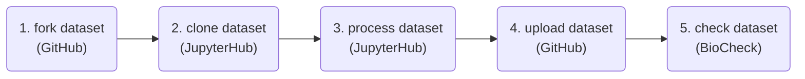

# OBIS-SG 12 training 🐠

> [!NOTE]  
> Read a distraction free version of this documentation [here](https://iobis.github.io/sg-12-training/). if you encounter any issues with this documentation please create a ticket [here](https://github.com/iobis/sg-12-training/issues).

This is part of the training material for the nodes training at the 12th OBIS-SG meeting. The goal of this training session is to teach how to use a number of tools which can help you manage, publish, and analyze your data more effectively, reproducibly, and collaboratively. These skills will also help you collaborate on code and documentation (including the OBIS manual).

During the training you will be introduced to the basics of using git, GitHub, JupyterHub, Darwin Core, and Darwin Core extensions. During the hands-on session we will quality control and format an eDNA dataset as Darwin Core, and we will publish the original data, the Darwin Core dataset, as well as our workflow to GitHub.

> [!NOTE]  
> We will use the command line as well as R programming, so if you are not comfortable with these try to team up with someone who is.

## Agenda

Monday 25 March 2024 (MABIK)

| Time | Topic | |
| -- | -- | -- |
| 10:00-10:45 | Darwin Core | 0:45 |
| 10:45-11:00 | Break | |
| 11:00-11:45 | Hands-on session: JupyterHub and OBIS products platform | 0:45 |
| 11:45-12:30 | Hands-on session: Git and GitHub | 0:45 |
| 12:30-13:30 | Lunch | |
| 13:30-14:40 | MeasurementOrFacts extension and vocabularies | 1:10 |
| 14:40-15:00 | DNADerivedData extension | 0:20 |
| 15:00-15:30 | Break | |
| 15:30-16:00 | Hands-on session: Downloading example dataset | 0:30 |

Tuesday 26 March 2024 (MABIK)

| Time | Topic | |
| -- | -- | -- |
| 09:00-10:30 | Hands-on session: quality control | 0:45 |
| 10:30-11:00 | Break | |
| 11:00-11:30 | Hands-on session: quality control (continued) | 0:30 |
| 11:30-12:30 | OBIS annotated names tool (to be confirmed) | 1:00 |

## Example dataset

The example eDNA dataset is available at <https://github.com/iobis/sg-12-dataset>, and an example Jupyter Notebook solution to the data cleaning exercise is available at <https://github.com/pieterprovoost/sg-12-dataset/blob/develop/scripts/pieter.ipynb>. Note that this notebook does not render perfectly on GitHub, so you may want to upload it to your JupyterHub environment (but more on that later).

## Contents

- [Using git](git.md)
- [Using GitHub](github.md)
- [The DNADerivedData extension](dna.md)
- [Processing an eDNA dataset](dataset.md)
