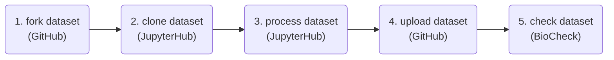

# OBIS SG 12 training 🐠

> [!NOTE]  
> Read a distraction free version of this documentation [here](https://iobis.github.io/sg-12-training/). if you encounter any issues with this documentation please create a ticket [here](https://github.com/iobis/sg-12-training/issues).

This is part of the training material for the nodes training at the 12th OBIS SG meeting, in which you will be introduced to the basics of using git, GitHub, JupyterHub, Darwin Core, and Darwin Core extensions. During the hands-on session you will quality control and publish an eDNA dataset as Darwin Core. You will use the command line as well as R programming, so if you are not comfortable with these try to team up with someone who is.

## Example dataset

The example eDNA dataset is available at <https://github.com/iobis/sg-12-dataset>, and an example Jupyter Notebook solution to the data cleaning exercise is available at <https://github.com/pieterprovoost/sg-12-dataset/blob/develop/scripts/pieter.ipynb>. Note that this notebook does not render perfectly on GitHub, so you may want to upload it to your JupyterHub environment (but more on that later).

## Contents

- [Using git](git.md)
- [Using GitHub](github.md)
- [Using JupyterHub](jupyterhub.md)
- [Processing an eDNA dataset](dataset.md)
- [The DNADerivedData extension](dna.md)
