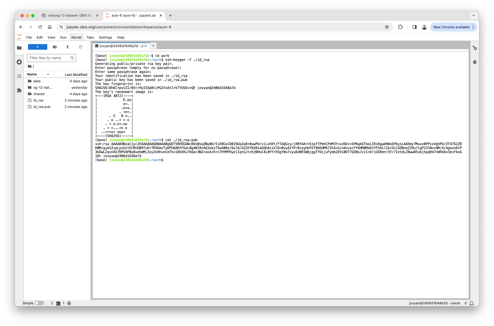
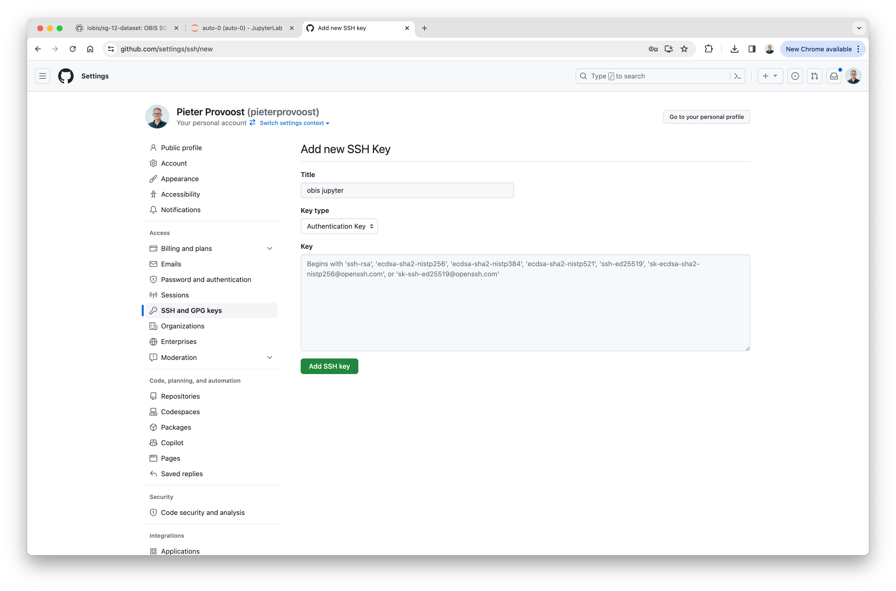

# Processing an eDNA dataset

## Authentication with GitHub

To be able to pull and push code from and to GitHub, we need to authenticate ourselves with GitHub first. To do this, we will generaten an SSH key pair, set is as the key pair to be used by git, and upload the public key to GitHub. Run the following commands in a new terminal:

```bash
ssh-keygen -f ~/work/id_rsa
git config core.sshCommand "ssh -i ~/work/id_rsa"
cat ~/work/id_rsa.pub
```

This will print the public key to the terminal. Copy the key, go to GitHub, and add it to your SSH keys in your account settings.





## Cloning the dataset repository

Open a new terminal in JupyterHub, navigate to the `work` folder, and clone your fork of the dataset repository. Make sure to change `<username>` in the command below to your own. After cloning, go into the dataset folder and create a new branch to work in.

```bash
cd work
git clone git@github.com:<username>/sg-12-dataset.git
cd sg-12-dataset
git checkout -b develop
```

The dataset folder should now show up in the sidebar.


## Creating a notebook

Close the terminal, navigate to `sg-12-dataset/scripts`, and create a new R notebook.

## Processing the dataset

An example solution is available at <https://github.com/pieterprovoost/sg-12-dataset>. If necessary, download the notebook from GitHub and upload it to your scripts folder.

To generate a Darwin Core Archive from Darwin Core data frames, you can use the <https://github.com/pieterprovoost/r-dwca-writer> package.

## Pushing your work to GitHub


```bash
(base) jovyan@82065e7c143d:~/work/sg-12-dataset$ git add .
(base) jovyan@82065e7c143d:~/work/sg-12-dataset$ git commit -m "example solution"
[develop 54b39e6] example solution
 1 file changed, 364 insertions(+)
 create mode 100644 scripts/pieter.ipynb
(base) jovyan@82065e7c143d:~/work/sg-12-dataset$ git push
fatal: The current branch develop has no upstream branch.
To push the current branch and set the remote as upstream, use

    git push --set-upstream origin develop

(base) jovyan@82065e7c143d:~/work/sg-12-dataset$ git push --set-upstream origin develop
Enumerating objects: 6, done.
Counting objects: 100% (6/6), done.
Delta compression using up to 4 threads
Compressing objects: 100% (4/4), done.
Writing objects: 100% (4/4), 3.12 KiB | 319.00 KiB/s, done.
Total 4 (delta 1), reused 0 (delta 0), pack-reused 0
remote: Resolving deltas: 100% (1/1), completed with 1 local object.
remote: 
remote: Create a pull request for 'develop' on GitHub by visiting:
remote:      https://github.com/pieterprovoost/sg-12-dataset/pull/new/develop
remote: 
To github.com:pieterprovoost/sg-12-dataset.git
 * [new branch]      develop -> develop
Branch 'develop' set up to track remote branch 'develop' from 'origin'.
```

## Checking your dataset using EMODnet BioCheck

Go to <https://rshiny.lifewatch.be/BioCheck/> and enter the URL of your Darwin Core Archive on GitHub. It should look like this: <https://github.com/pieterprovoost/sg-12-dataset/raw/develop/dwc/pieter/archive.zip>.