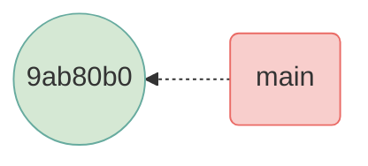
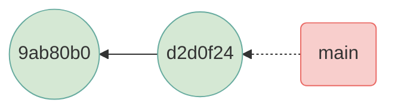
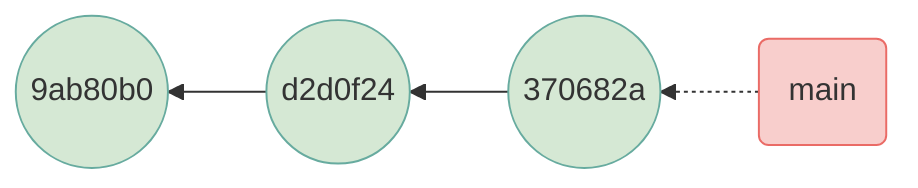
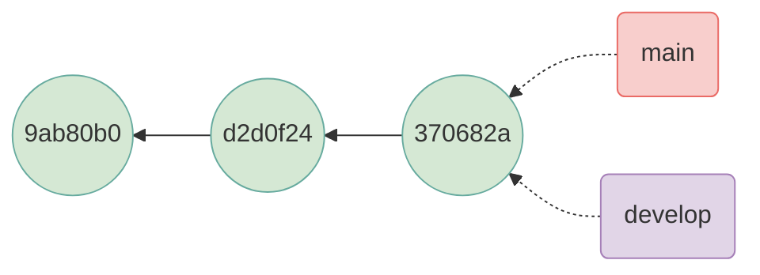
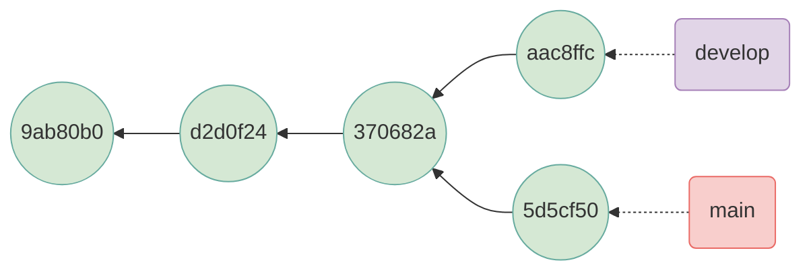
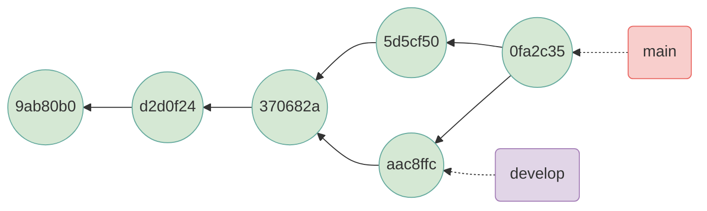
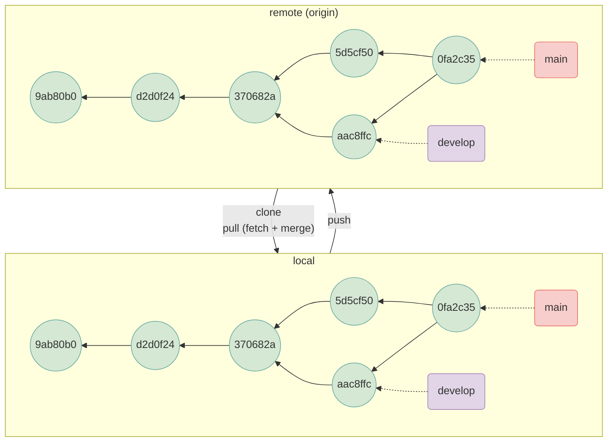

# Git

## What is git?

## Initializing a repository

```bash
% git init
Initialized empty Git repository in /Users/pieter/Desktop/git/.git/
```

```bash
% git status
On branch main

No commits yet

nothing to commit (create/copy files and use "git add" to track)
```

## Adding files

Files can be added to the index using `git add`.

```bash
% git status
On branch main

No commits yet

Untracked files:
  (use "git add <file>..." to include in what will be committed)
	test.txt

nothing added to commit but untracked files present (use "git add" to track)
```

```bash
% git add test.txt
```

```bash
% git status
On branch main

No commits yet

Changes to be committed:
  (use "git rm --cached <file>..." to unstage)
	new file:   test.txt
```

## Saving changes

Staged changes can be committed using `git commit`.

```bash
% git commit -m "first commit"
[main (root-commit) 9ab80b0] first commit
 1 file changed, 0 insertions(+), 0 deletions(-)
 create mode 100644 test.txt
```

```bash
% git status
On branch main
nothing to commit, working tree clean
```



```bash
% touch test2.txt
% git add test2.txt
% git commit -m "added one more file"
[main(main) d2d0f24] added one more file
 1 file changed, 0 insertions(+), 0 deletions(-)
 create mode 100644 test2.txt
```



Check the commit history using `git log`.

```bash
% git log
commit d2d0f24cab33f87126e3d0108c13a8a3f86f8da3 (HEAD -> main)
Author: Pieter Provoost <pieterprovoost@gmail.com>
Date:   Fri Mar 8 20:05:12 2024 +0100

    added one more file

commit 9ab80b05e916d5a3065eae0a6603f06251fa8c28
Author: Pieter Provoost <pieterprovoost@gmail.com>
Date:   Fri Mar 8 19:15:05 2024 +0100

    first commit
```

Let's make one more change and add some text to `test.txt`:

```bash
% echo "here's a line of text" >> test.txt
% git add .
% git commit -m "added some text"
[main 370682a] added some text
 1 file changed, 1 insertion(+)
```

Our repository now looks like this:



## Branching

We will now create a new branch so we can commit changes without affecting the main branch. Once we are ready, we can merge the changes back into the main branch.

A branch is really just a pointer to a commit. When we create a new branch, we create a pointer to the current commit.

We can use `git branch` and `git checkout` to create and switch branches, but there is a shortcut: `git checkout -b`.

```bash
% git checkout -b develop
Switched to a new branch 'develop'
```



If we now make more changes and commit them, the `develop` branch will move forward, but the `main` branch will stay where it is.

```bash
% echo "here's a line of text" >> test2.txt
% git add .
% git commit -m "added text to test2.txt"
[develop aac8ffc] added text to test2.txt
 1 file changed, 1 insertion(+)
```

Now switch back to the `main` branch and make a change there.

```bash
% git checkout main
Switched to branch 'main'
% echo "here's another line of text" >> test.txt
% git add .
% git commit -m "changed the first file"
[main 5d5cf50] changed the first file
 1 file changed, 1 insertion(+)
```



## Merging branches

`git merge` incorporates changes from another history into the current branch. The result is recorded in a new commit.

```bash
% git merge -m "merge branch develop" develop
% git merge develop
Merge made by the 'ort' strategy.
 test2.txt | 1 +
 1 file changed, 1 insertion(+)
% git log
commit 3d4cdcae41f1ff8ab7811db0a700fbc4876164ec (HEAD -> main)
Merge: 5d5cf50 aac8ffc
Author: Pieter Provoost <pieterprovoost@gmail.com>
Date:   Wed Mar 13 14:53:57 2024 +0100

    merge branch develop
```



## Working with remotes

```bash
% git remote add origin https://remote-repo-url.git
```

```bash
% git push --set-upstream origin main
Enumerating objects: 15, done.
Counting objects: 100% (15/15), done.
Delta compression using up to 10 threads
Compressing objects: 100% (12/12), done.
Writing objects: 100% (15/15), 1.36 KiB | 1.36 MiB/s, done.
Total 15 (delta 1), reused 0 (delta 0), pack-reused 0
To https://remote-repo-url.git
 * [new branch]      main -> main
branch 'main' set up to track 'origin/main'.
```

```bash
% git push --set-upstream origin develop
Total 0 (delta 0), reused 0 (delta 0), pack-reused 0
To https://remote-repo-url.git
 * [new branch]      develop -> develop
branch 'develop' set up to track 'origin/develop'.
```


