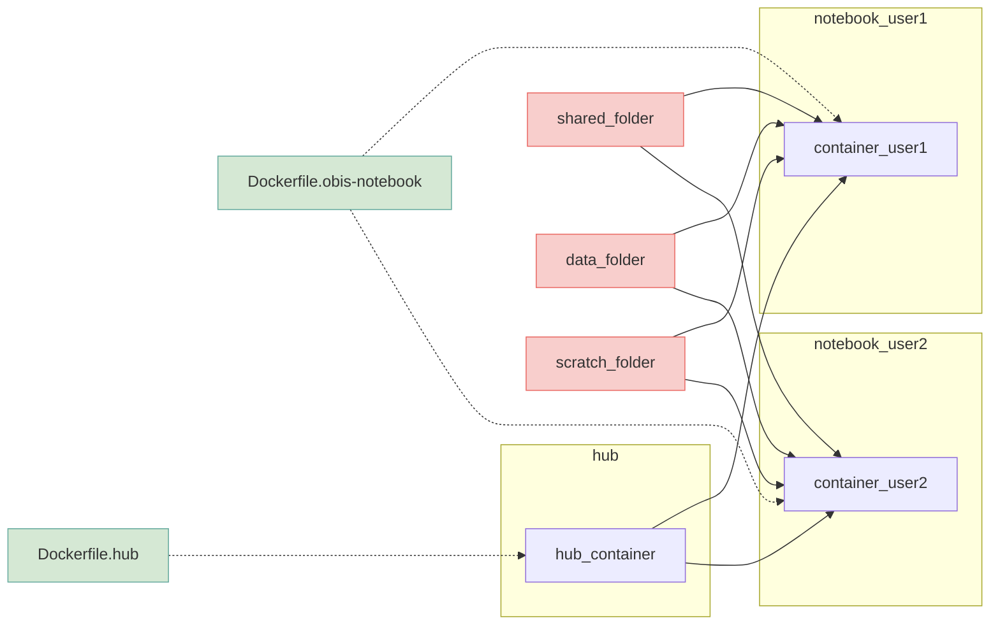

# JupyterHub

JupyterHub is a multi-user server-hosted Jupyter notebook environment. The OBIS JupyterHub is hosted at <https://jupyter.obis.org>. After registration and approval by the administrators, you will be able to access the hub and create R and Python notebooks. Users also have access to example notebooks and datasets in a shared folder.

## Creating and running a notebook

[to be added]